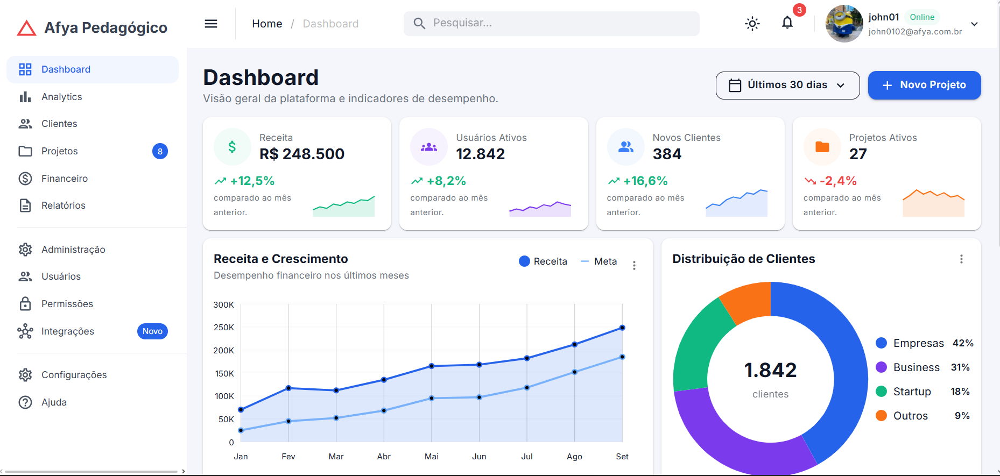
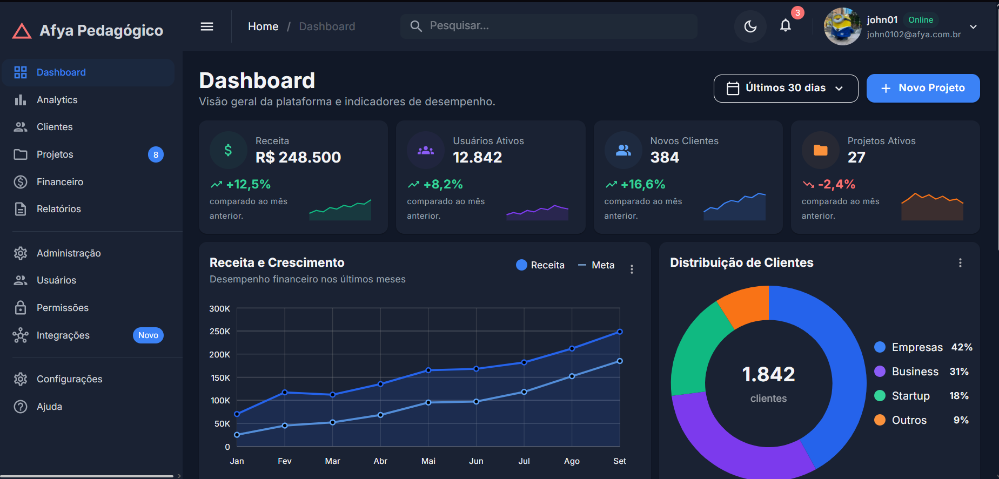
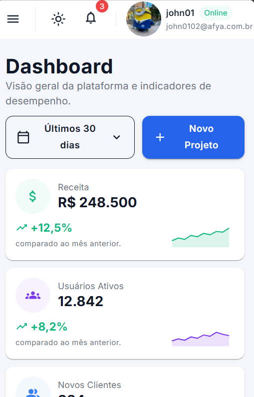
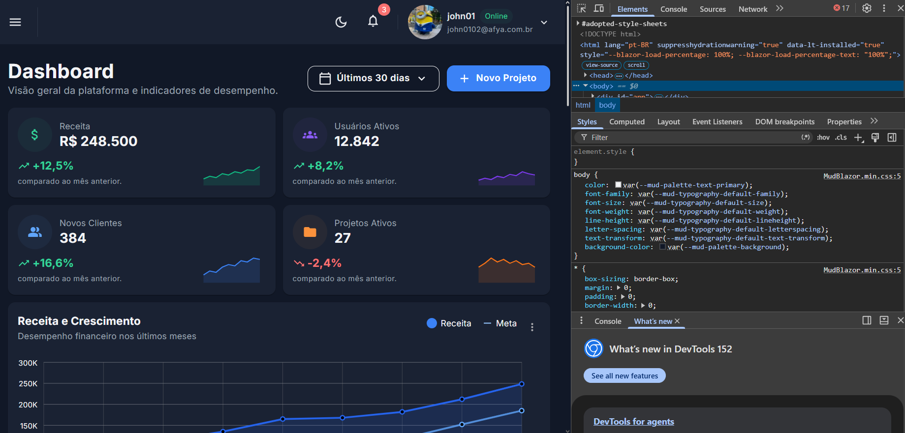

# Afya Admin — Dashboard com Blazor WebAssembly e MudBlazor

## Identificação

| | |
|---|---|
| **John Kleverson Barbosa Rosa** |
| **	2653519** |
| **AFYA ** |
| **CIENCIA DA COMPUTAÇÃO** |
| **PROGRAMAÇÃO PARA SISTEMAS WEB** |
| **LILOYOUD CURY LACERDA** |
| **2026.2** |

## Objetivo do projeto

Objetivo do projeto é a construção de um Dashboard, painel administrativo, para a Afya Pedagógico. Com foco no aprendizado de Blazor WebAssembly e Mudblazor. Objetivo foi entender como funciona e como utilizar as tecnologias, como o Blazor faz para gerar o HTML a partir do Razor.
A página reúne sidebar, AppBar, KPIs com mini gráficos, gráficos de linha e de rosca, performance dos projetos, atividades recentes e uma tabela. Tudo sem necessidade de utilizar CSS, usando apenas o MudTheme e classes do MudBlazor.

## Tecnologias utilizadas

- .NET 10 / Blazor WebAssembly
- MudBlazor 9
- C# e Razor
- Git e Github
- VSCODE com C# Dev Kit

## Como executar

Pré-requisito: .NET SDK 10 (confira com dotnet --version, que deve começar com 10.).

```bash
git clone https://github.com/caz1ogit/afya-admin.git
cd afya-admin
dotnet watch
```

## Telas

### Tema claro


### Tema escuro


### Versão mobile


### HTML gerado (DevTools)


Ao inspecionar o HTML gerado, cada parâmetro dos componentes vira uma classe CSS. 
O <MudPaper Elevation="1" Class="pa-4"> virou uma <div class="mud-paper mud-elevation-1 pa-4">, e o Height="100%" virou o atributo style. Os <MudStack> viraram <div> com classes de flexbox: Row="true" virou flex-row, AlignItems.Center virou align-center e Spacing="3" virou gap-3. O <MudButton> virou um <button> com mud-button-filled, mud-button-filled-primary e mud-button-filled-size-large, vindos de Variant, Color e Size. Já o <MudAvatar> do KPI recebeu a classe mud-success-hover, devolvida por Ui.FundoSuave(Color.Success), que cria o fundo verde claro sem CSS próprio.

## Estrutura do projeto

```
afya-admin/
├── Components/
│   ├── AtividadesRecentes.razor
│   ├── CabecalhoPagina.razor
│   ├── DashboardCard.razor
│   ├── GraficoDistribuicaoClientes.razor
│   ├── GraficoReceita.razor
│   ├── KpiCard.razor
│   ├── PerformanceProjetos.razor
│   ├── ProjetosRecentes.razor
│   ├── SeletorPeriodo.razor
│   └── Ui.cs
├── Data/
│   └── DashboardData.cs
├── Layout/
│   ├── MainLayout.razor
│   └── NavMenu.razor
├── Pages/
│   ├── Dashboard.razor
│   └── NotFound.razor
├── Properties/launchSettings.json
├── docs/prints/
├── wwwroot/
│   ├── css/app.css
│   ├── img/alex-morgan.jpg
│   └── index.html
├── _Imports.razor
├── afya-admin.csproj
├── App.razor
└── Program.cs
```

## Componentes criados

| Componente | Responsabilidade | Parâmetros |
|---|---|---|
| `DashboardCard` | Card base reutilizável com título, subtítulo, ações, menu "⋮" e conteúdo | `Titulo`, `Subtitulo`, `Acoes`, `Menu`, `ChildContent` |
| `CabecalhoPagina` | Título e subtítulo da página, com botões de ação à direita | `Titulo`, `Subtitulo`, `Acoes` |
| `SeletorPeriodo` | Menu com aparência de botão para escolher o período | `Opcoes`, `Valor`, `ValorChanged` |
| `KpiCard` | Card de indicador com ícone, valor, variação e sparkline | `Kpi` |
| `GraficoReceita` | Gráfico de linha Receita x Meta | `Meses`, `Receita`, `Meta` |
| `GraficoDistribuicaoClientes` | Gráfico de rosca com total no centro e legenda com percentuais | `Total`, `Segmentos` |
| `PerformanceProjetos` | Lista de projetos com barras de progresso | `Projetos` |
| `AtividadesRecentes` | Feed de atividades recentes | `Atividades` |
| `ProjetosRecentes` | Tabela de projetos recentes | `Projetos` |

## O que aprendi

1. **Como uma aplicação Blazor WebAssembly inicia no navegador? Qual é o papel do `index.html`, da `<div id="app">` e do `Program.cs`?**

   Entendi que o `index.html` é a página inicial e a `<div id="app">` é onde a aplicação aparece. O script do Blazor carrega o runtime .NET, e o `Program.cs` configura os serviços e inicia a aplicação nesse espaço.

2. **Qual é a diferença entre um Layout, uma Page e um Component neste projeto? Dê um exemplo de cada.**

   O Layout é a estrutura comum da tela, como o `MainLayout.razor`. A Page tem uma rota, como o `Dashboard.razor`. Já o Component é uma parte reutilizável, como o `KpiCard.razor`, que mostra um indicador.

3. **O que é um `RenderFragment` e como o `DashboardCard` usa esse recurso para ser reutilizado por vários cards?**

   Entendi que é um trecho de conteúdo passado para um componente. No `DashboardCard`, isso permite usar a mesma estrutura de card com conteúdos diferentes, como um gráfico ou uma tabela, pelos parâmetros `Acoes`, `Menu` e `ChildContent`.

4. **Como funciona o `@bind-Valor` no `SeletorPeriodo`? Qual é o papel do `ValorChanged`?**

   O `@bind-Valor` liga a seleção à variável `_periodo`. Ao escolher uma opção, o `ValorChanged` avisa a página para atualizar esse valor. Nesta versão, isso só muda o texto do botão; os dados continuam iguais.

5. **Por que os dados ficam na pasta `Data`, separados dos componentes? Que vantagem isso traz se, no futuro, os dados vierem de uma API?**

   Os dados ficam em `Data` e os componentes cuidam de mostrar as informações. Assim, fica mais fácil trocar os dados fictícios por dados de uma API sem refazer o visual.

6. **Como o `MudGrid` com `xs`, `sm` e `lg` faz os cards de KPI se reorganizarem em telas de tamanhos diferentes?**

   O grid tem 12 colunas. Com `xs="12"`, fica um card por linha; a partir de `sm="6"`, ficam dois; e a partir de `lg="3"`, ficam quatro.

7. **Como foi possível estilizar a página inteira sem escrever CSS? Explique o papel do tema (`MudTheme`) e das classes utilitárias.**

   O `MudTheme` define cores e fontes, e classes como `pa-4` e `mb-4` ajustam os espaços. O visual do dashboard usa esses recursos, embora o CSS do template continue no projeto.

8. **Por que o namespace do projeto é `afya_admin` e não `afya-admin`?**

   Porque o hífen não é permitido em nomes de C#: ele representa subtração. Por isso, o SDK transforma o nome do projeto em `afya_admin`, usando sublinhado no namespace.

## Dificuldades e soluções

1. **Linhas cortadas no PDF.** Alguns trechos vieram incompletos, com tags, aspas e parâmetros faltando. Completei essas partes nos arquivos para corrigir os erros de compilação. O mais confuso foi que nem sempre o erro apontava para a causa: em `PerformanceProjetos.razor`, uma tag `MudText` sem fechamento gerou vários erros em outras linhas.

2. **Imports faltando.** Faltavam `@using afya_admin.Components` e `@using afya_admin.Data` no `_Imports.razor`. Sem eles, os componentes não eram reconhecidos e o `@bind-Valor` também dava erro. Adicionar essas duas linhas resolveu os problemas relacionados.
